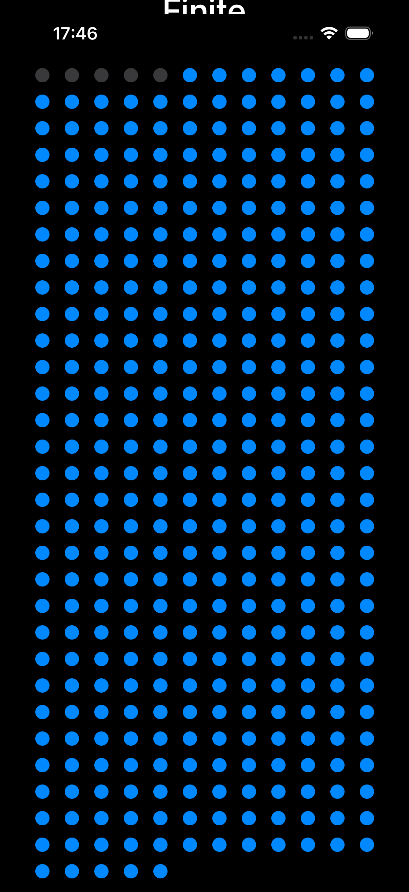

# FINITE

> A quiet, visual reminder to make today count.

FINITE is a privacy-first iOS app that turns a year into 365 visible days. Mark one day at a time, see the time ahead of you, and build a deliberate daily practice without accounts, notifications, or distractions.



## Highlights

- A tactile 365-day progress grid
- Clear completed, remaining, and percentage statistics
- One-tap daily check-in with native haptic feedback
- Undo and reset controls with confirmation
- Local persistence using `@AppStorage`
- VoiceOver labels and Dynamic Type-friendly typography
- Fully native SwiftUI implementation with no third-party dependencies

## Product philosophy

Most habit trackers add more: streaks, charts, accounts, subscriptions, and reminders. FINITE keeps the interaction intentionally small. Open the app, acknowledge the day, and move on.

## Tech stack

| Area | Implementation |
| --- | --- |
| Platform | iOS 17+ |
| Language | Swift |
| Interface | SwiftUI |
| Persistence | `UserDefaults` through `@AppStorage` |
| Feedback | `UIImpactFeedbackGenerator` |
| Dependencies | None |

## Run locally

1. Clone the repository:

   ```bash
   git clone https://github.com/sunnynitin3119/FINITE.git
   ```

2. Open `FINITE.xcodeproj` in Xcode.
3. Select an iPhone simulator or connected device.
4. Build and run with <kbd>⌘R</kbd>.

## Project structure

```text
FINITE/
├── FINITE/
│   ├── ContentView.swift
│   ├── FINITEApp.swift
│   └── Assets.xcassets
└── FINITE.xcodeproj
```

## Roadmap

- Configurable time horizons
- Home Screen and Lock Screen widgets
- Calendar-aware daily check-ins
- Optional iCloud sync
- App icon and launch-screen variants

## Author

Created by **Sunny Nitin** — iOS, data, and software engineer.

## Licence

This project currently has no open-source licence. Add a `LICENSE` file before accepting external contributions.
